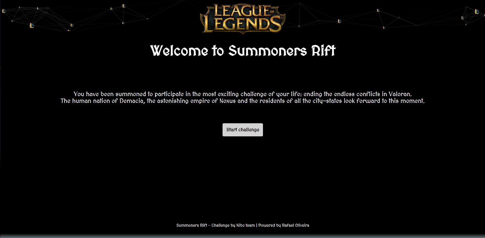

# SummonersRift

This project was generated with [Angular CLI](https://github.com/angular/angular-cli) version 12.1.2.

## How to run

- Git clone: https://github.com/rafamoliv/FrontendChallenge.git
- cd src/summoners-rift and run **`npm install`**. Navigate to `http://localhost:4200/`. The app will automatically reload if you change any of the source files.
- cd src and run **`ng serve`**

## Screenshots

   
   
  

## Build

Run `ng build` to build the project. The build artifacts will be stored in the `dist/` directory.

## Running unit tests

Run `ng test` to execute the unit tests via [Karma](https://karma-runner.github.io).

## Running end-to-end tests

Run `ng e2e` to execute the end-to-end tests via a platform of your choice. To use this command, you need to first add a package that implements end-to-end testing capabilities.
